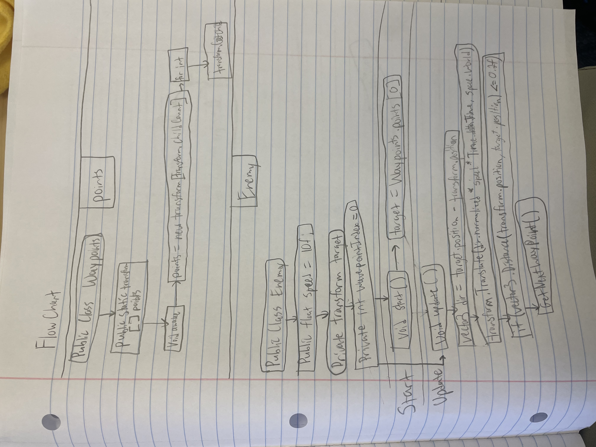
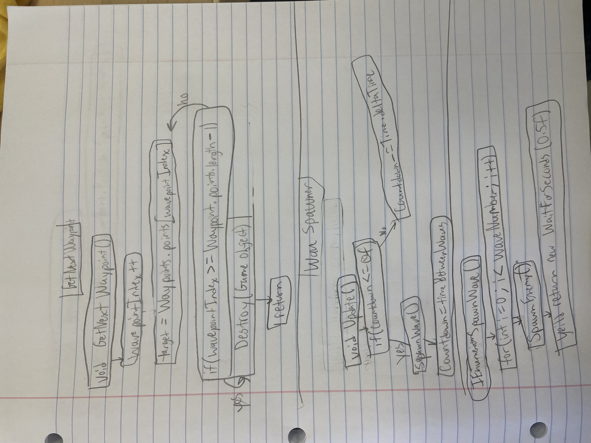
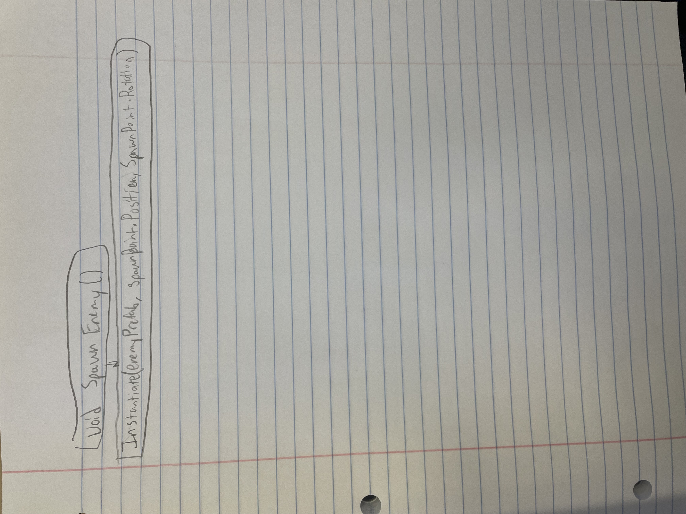

# Tower Defence 

### The game will store the location of every waypoint in a Transform. The game will have AI that is able to follow a path. And there will be AI that is able to move. Eventually the program will have a start button, and buttons for buying items in the shop. 
### 

### For section I am going to break down Wave Spawner. How this flowchart works is that it starts off that if our timer reaches zero, we want it to spawn enemies. There is a countdown timer, that is then reduced to have it where the code runs out of time, and starts to spawn the enemies. We say that time is through time.deltaTime. So when it hits 0, it spawns a wave, and the timer resets to 5. Then every time we spawn a wave, we will increase the wave number every single iteration. Then there is code that will make it so that the enemy will spawn at the right location, resulting in enemies being spawned. 