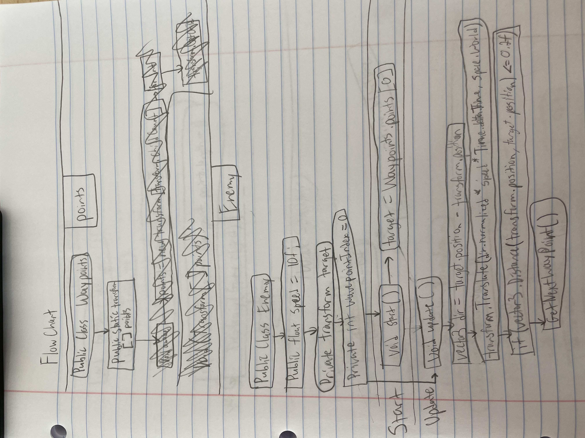
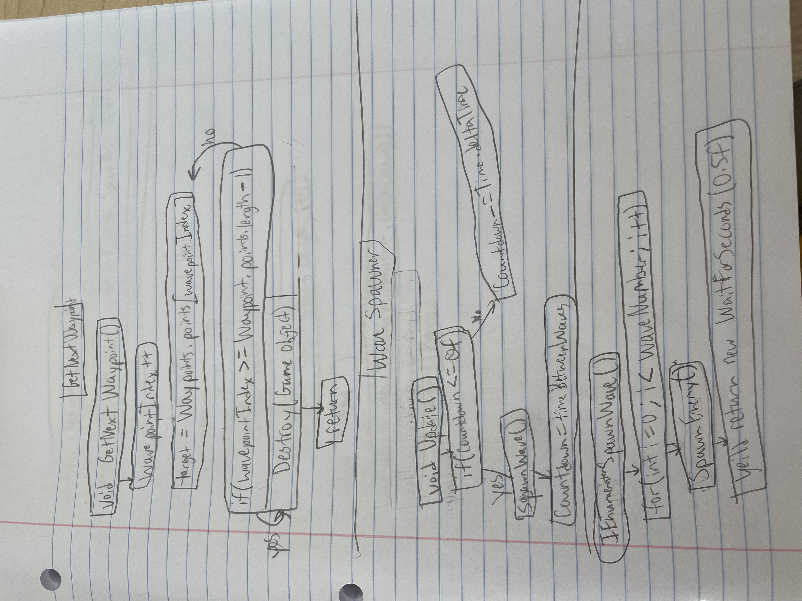
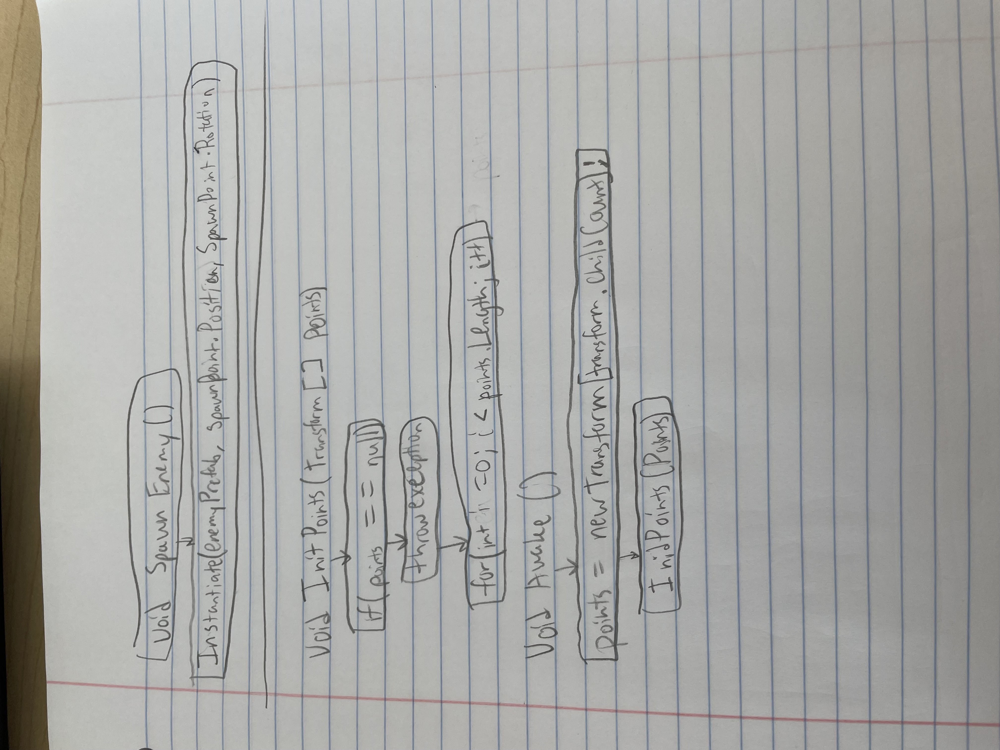

# Tower Defence 

### The game will store the location of every waypoint in a Transform. The game will have AI that is able to follow a path. And there will be AI that is able to move. Eventually the program will have a start button, and buttons for buying items in the shop. 
### 

##
## Points 
// Transformed used for creating an array, a list a items, which the transformed used to a list of game points
## Enemy 
// Float speed is meant to express the speed of the AI 
// Then there is a target, which is private so the enemy only have it in their script
// The current waypoint that the AI is going too is sown in wavepointIndex
## Start
// The game starts
// The AI , at the start of the game, will then go to waypoint 0 
## Update 
// Create a direction the enemy is pointing 
// Have the enemy move with the vector, using the variables of time and speed
// When the enemy is at the waypoint which is a specific point
// The enemy will get the next wave point
##

##
## Wave Point 
// If the wave point is trying to go to one not existing 
// Then Destroy the Enemy 
// The wave point index will increase by one 
// The target is going to be the new wave point that is given from above code
## Wave Spawner 
// If the time for the countdown is 0 
// Spawn the wave and set countdown to normal time 
// If not then countdown will decrease by one second. 
## Spawn Wave 
// So when it spawns, increase the wave number by one 
// So each time the wave number is 0
// Spawn Enemy 
// Then wait for the time between waves 
##

##
## Spawn Enemy 
// We are going to make the enemy spawn at a specific location and correct direction
## Transform Points 
// If there are no more points 
// Go to void awake 
## Void Awake 
// The points change the amount of points
// And then the new points are created. 

